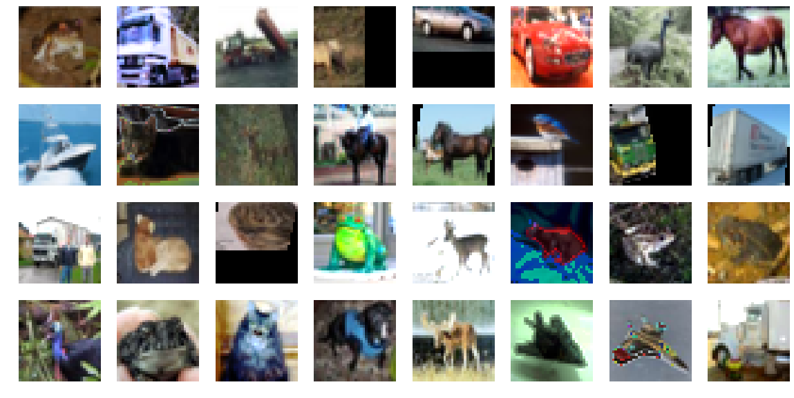

# PyTorch implementation of AutoAugment
This repository contains code for **AutoAugment** (only using paper's best policies) based on [AutoAugment:
Learning Augmentation Policies from Data](https://arxiv.org/abs/1805.09501) implemented in PyTorch.



## Requirements
- Python 3.6
- PyTorch 1.0

## Training
### CIFAR-10
WideResNet28-10 baseline on CIFAR-10:
```
python train.py
```
WideResNet28-10 +Cutout, AutoAugment on CIFAR-10:
```
python train.py --cutout True --auto-augment True
```

## Results
### CIFAR-10
| Model                              |   Accuracy (%)    |   Loss   |
|:-----------------------------------|:-----------------:|:--------:|
|WideResNet28-10 baseline            |                   |          |
|WideResNet28-10 +Cutout, AutoAugment|                   |          |
