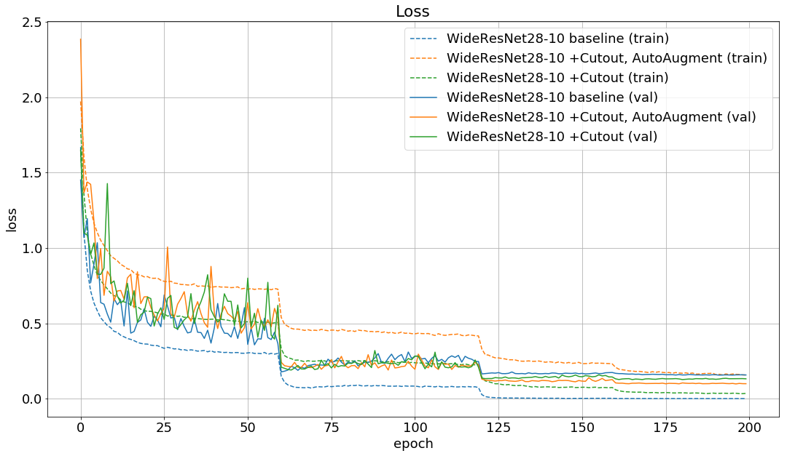

# PyTorch implementation of AutoAugment
This repository contains code for **AutoAugment** (only using paper's best policies) based on [AutoAugment:
Learning Augmentation Policies from Data](https://arxiv.org/abs/1805.09501) implemented in PyTorch.


## Requirements
- Python 3.6
- PyTorch 1.0

## Training
### CIFAR-10
WideResNet28-10 baseline on CIFAR-10:
```
python train.py
```
WideResNet28-10 +Cutout, AutoAugment on CIFAR-10:
```
python train.py --cutout True --auto-augment True
```

## Results
### CIFAR-10
| Model                                               | Error rate |   Loss   | Error rate (paper) |
|:----------------------------------------------------|:----------:|:--------:|:------------------:|
|WideResNet28-10 baseline                             |        3.82|    0.1576|                3.87|
|WideResNet28-10 +Cutout                              |        3.40|    0.1280|                3.08|
|WideResNet28-10 +Cutout, AutoAugment                 |    **2.91**|**0.0994**|            **2.68**|

Learning curves of loss and accuracy.




